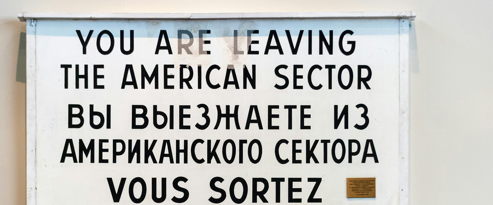

I started a new project, where I need URLs to contain non-latin characters (like `/тест`, which is `/test` in Cyrillic). The page's file name (using AppsRouter) is what determines the URL.

Well, it seems there's a four-and-a-half year old (**still** opened) [GitHub issue](https://github.com/vercel/next.js/issues/10084) about that. Next doesn't like non-latin characters, as the router isn't dealing with decoding good enough.

A simple workaround is to name your files with encoded values. So `тест.tsx` becomes `%D1%82%D0%B5%D1%81%D1%82.tsx`. Awesome DX! 🎉

I've ended up naming my pages in English, and then using Next [config rewrites](https://nextjs.org/docs/pages/api-reference/config/next-config-js/rewrites), where I encode my URLs.
