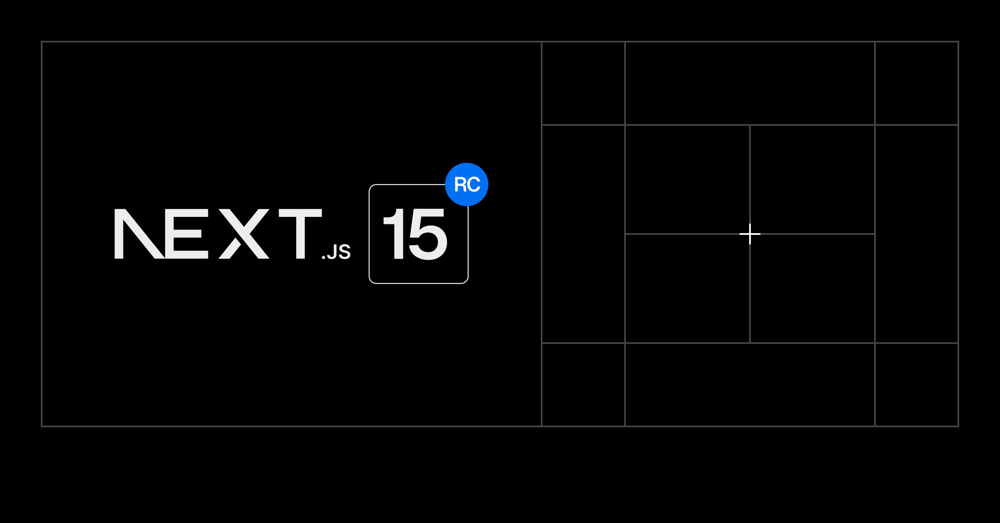

On 21st of October, [Next.js 15](https://nextjs.org/blog/next-15) was officially released, yay! 🎉

Among the release notes there's this [note](https://nextjs.org/blog/next-15#react-19):

> In version 15, the App Router uses **React 19 RC**

Depending on a release candidate? 🤔 How bad can it be?

> Although React 19 is still in the RC phase, our extensive testing across real-world applications and our close work with the React team have given us confidence in its stability.

And that's probably true. What wasn't accounted for are the numerous dependencies on `react: ^18.x` all over the internet.

Including [radix-ui/icons](https://github.com/radix-ui/icons/pull/184). Which makes [shadcn/ui](https://github.com/shadcn-ui/ui/issues/5555) unable to install properly. And sadly, we were using those 😔

It took a good full week to fix this issue, which is surely not directly Vercel's fault. But it kind of is, isn't it?
