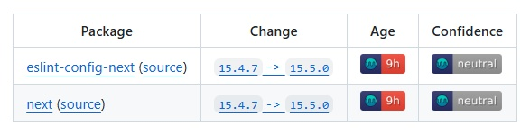

I'm delving into personal projects way more than before, and I started using [Renovate](https://www.mend.io/renovate/) extensively for keeping my dependencies up to date. It saves tons of time and effort to deal with this tedious task.

And man, do I get goosebumps every time a new Next.js release pops up?!

I'd expect it to be a walk in the park, and yet...

- **amount of changes** - Some releases contain just a few changes, but the "real ones" would make you cry. `v15.5.0` contains **234 core changes**, and **215 misc changes**. Good luck there's something that won't affect you.

- **canary piling / versioning** - They mix canary releases _along_ regular ones. It seems the team aims for "_the next big release_" right from the last of this kind, but they don't bother with semver that much.
  
  So after `v15.4.1`, they started having `v15.4.2-canary.1`. Which does not mean the next "official" release would be `v15.4.2`, oh no, it turned out to be `v15.5.0`!

- **backporting** - Meanwhile, they make other releases, I guess with important fixes. Something like "not quite a release, but still". After `v15.4.1` there's `v15.4.2` saying:

> This release is backporting bug fixes. It does not include all pending features/<wbr>changes on canary.

- **no release notes** - They didn't configure any release notes properly, so you never know what you're getting. You have to go to github and patiently read the 6 screen "summary" of what they did, most of the time without understanding a word because of internals.

---

There's nothing utterly complex here - people have figured it out ages ago. `semver` exists for a reason. Continuous delivery is blooming. Astro is shipping things in such a small and thoughtful way it's a pleasure knowing things will work! Just check the confidence level of Renovate - even 28 days after a new Next.js release, it's still "neutral", while Astro's are beaming green a few hours later!

I'm sure maintaining this monster is not an easy task. Yet, there are simple steps to improve DX tremendously, and I expect a company like that to tackle them.
